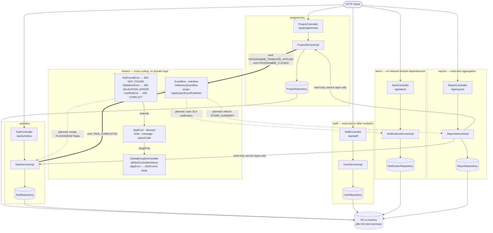
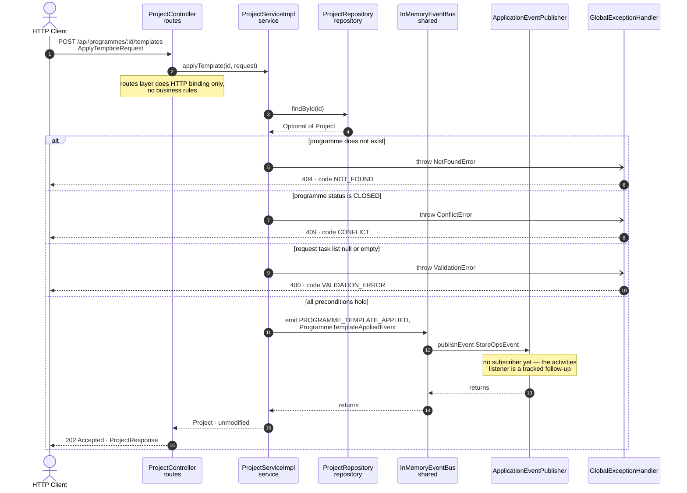

# ARCHITECTURE.md — StoreOps API Structure and Request Flow

Diagrams derived from the code in `src/main/java/com/cognizant/storeops/`,
not from the design docs. Where the code and the docs disagree, the code
wins and the difference is called out under [Notes](#notes-on-what-the-diagrams-show).

**Stack:** Java 17 · Spring Boot 3.3.2 · Spring Data JPA · H2 (in-memory)
· JUnit 5 + MockMvc · Checkstyle + SpotBugs

---

## 1. Architecture diagram

Five domain modules, each with three layers, plus a `shared` package that
carries the error hierarchy and the event bus. Solid arrows are
compile-time dependencies that exist today; dashed arrows are event
subscriptions that are specified but **not yet implemented**.



### Boundary rules, and how the diagram shows them upheld

| Rule | Evidence in the diagram |
|---|---|
| No cross-module repository access | Every arrow into a cylinder starts inside the same module subgraph |
| No circular imports | The only inter-module solid edges are `reports → programmes` and `reports → activities`; nothing points back into `reports` |
| Cross-module side effects via event bus only | `programmes` and `activities` reach other modules only through the thick `EventBus` edges |
| `staff` read-only to other modules | No module has an edge into `staff` at all — it is a leaf |
| `reports` writes nothing outside itself | `reports` calls only reading methods on `ProjectService` / `TaskService` |

---

## 2. Flow diagram

`POST /api/programmes/{id}/templates` — the harness demonstration
feature, and the one endpoint that exercises validation, conflict
handling, typed errors, and the event bus in a single request.



### Why `202`, and why the response carries no tasks

`programmes` never creates `Task` rows — that is the `activities`
module's data. It emits the intent and returns `202 Accepted`, so the
caller knows the work was admitted but is not yet complete. Returning
`201` with a task list would require `ProjectServiceImpl` to import
`activities`, which is exactly the coupling the module boundary exists
to prevent. See `DESIGN_BRIEF.md` Section D, Decision 1.

### Error path shape

All three error branches converge on one handler, so every failure —
from any endpoint in any module — returns the same body:

```json
{ "code": "CONFLICT", "message": "...", "timestamp": "2026-09-08T..." }
```

No controller builds an error `ResponseEntity` itself, and no service or
route throws a raw `RuntimeException`.

---

## Notes on what the diagrams show

1. **The three events have no subscribers yet.** `PROGRAMME_CLOSED`,
   `PROGRAMME_TEMPLATE_APPLIED`, and `TASK_COMPLETED` are all emitted;
   `grep -rn "@EventListener" src/main/java` returns nothing. The dashed
   arrows are the contracted-but-unbuilt half. This is deliberate — the
   consuming side was split into a follow-up sprint (`DESIGN_BRIEF.md`
   Section A) — but it means `alerts` is currently reachable only via its
   own HTTP routes.

2. **`reports` reads its sibling modules synchronously,** through
   `ProjectService` and `TaskService`. That is a real compile-time
   dependency, permitted because it targets the service layer (not
   repositories) and calls no mutating method.

3. **Persistence is JPA over embedded H2,** not plain in-memory
   collections. No external database is needed, but the repositories are
   `JpaRepository` interfaces.

4. **`GlobalExceptionHandler` is drawn as a participant receiving throws.**
   In reality the exception propagates up the call stack through the
   controller and is intercepted by Spring's `@RestControllerAdvice`; the
   diagram compresses that into a direct edge for readability.

---

## Regenerating / verifying

```bash
JAVA_HOME="C:/Users/240422/jdk-17.0.11" mvn -B clean verify
```

Both diagrams were checked against the source at commit `3f0b374`
(35 tests, Checkstyle and SpotBugs clean).
